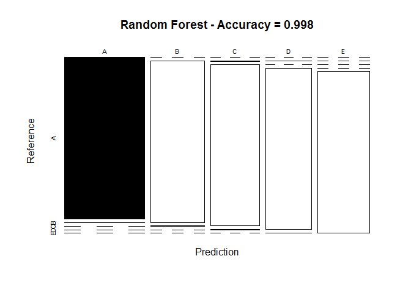

# Practical Machine Learning Course Project
Binod Chataut  
May 13, 2016  

Executive Summary
===
Devices such as Jawbone Up, Nike FuelBand, and Fitbit have made it easier to collect massive amount of data about personal activity in a cheaper way. Tech geeks or enthusiats who like to keep track of their of their health and find a pattern in their behavior mostly use such devices. These sort of devices are used to record self movement. In this project, data from accelerometers on the belt, forearm, arm, and dumbell of 6 participants will be used. They were asked to perform barbell lifts correctly and incorrectly in 5 different ways

The goal of this project is to predict the manner in which they did the exercise. This is the "classe" variable in the training set. You may use any of the other variables to predict with. You should create a report describing how you built your model, how you used cross validation, what you think the expected out of sample error is, and why you made the choices you did. You will also use your prediction model to predict 20 different test cases.

Loading libraries
===

```r
library(caret)
```

```
## Warning: package 'caret' was built under R version 3.2.5
```

```
## Loading required package: lattice
```

```
## Loading required package: ggplot2
```

```
## Warning: package 'ggplot2' was built under R version 3.2.5
```

```r
library(gbm)
```

```
## Warning: package 'gbm' was built under R version 3.2.5
```

```
## Loading required package: survival
```

```
## 
## Attaching package: 'survival'
```

```
## The following object is masked from 'package:caret':
## 
##     cluster
```

```
## Loading required package: splines
```

```
## Loading required package: parallel
```

```
## Loaded gbm 2.1.1
```

```r
library(corrplot)
```

```
## Warning: package 'corrplot' was built under R version 3.2.5
```

```r
library(randomForest)
```

```
## Warning: package 'randomForest' was built under R version 3.2.5
```

```
## randomForest 4.6-12
```

```
## Type rfNews() to see new features/changes/bug fixes.
```

```
## 
## Attaching package: 'randomForest'
```

```
## The following object is masked from 'package:ggplot2':
## 
##     margin
```

Loading Dataset
===
The dataset for this project are available here:
[training dataset](https://d396qusza40orc.cloudfront.net/predmachlearn/pml-training.csv)

[testing dataset](https://d396qusza40orc.cloudfront.net/predmachlearn/pml-testing.csv)

You can also download datafile and load data to R using below commands or you can keep the downloaded file in to your working directory.


```r
train_file <- "pml-training.csv"
destfile1  <-"pml-training.csv"

test_file <- "pml-testing.csv" 
destfile2  <-"pml-testing.csv"
train_url <- "https://d396qusza40orc.cloudfront.net/predmachlearn/pml-training.csv"
if (!file.exists(train_file)){
    download.file(train_url, destfile1)    
}

test_url <- "https://d396qusza40orc.cloudfront.net/predmachlearn/pml-testing.csv"
if (!file.exists(test_file)){
    download.file(test_url,destfile2)  
}
```

Load the dataset into R

```r
train_data <- read.csv(train_file, na.strings = c("#DIV/0!","NA"))
final_test_data <- read.csv(test_file, na.strings = c("#DIV/0!","NA"))
dim(train_data)
```

```
## [1] 19622   160
```

```r
dim(final_test_data)
```

```
## [1]  20 160
```

# Cleaning Data
First five columns(X,user_name,raw_timestamp_part_1, raw_timestamp_part_2, cvtd_timestamp) has no significance in building a prediction model. So, removing first five columns

```r
train_data <- subset(train_data, select = -(1:5))
```

To estimate the out-of-sample error, 

```r
set.seed(10)
inTrain <- createDataPartition(y=train_data$classe, p=0.7, list=F)
ptrain1 <- train_data[inTrain, ]
ptrain2 <- train_data[-inTrain, ]
```


```r
# remove variables with nearly zero variance
zerovarIndex <- nearZeroVar(ptrain1)
ptrain1 <- ptrain1[, -zerovarIndex]
ptrain2 <- ptrain2[, -zerovarIndex]

# remove variables that are almost always NA
mostlyNA <- sapply(ptrain1, function(x) mean(is.na(x))) > 0.95
ptrain1 <- ptrain1[, mostlyNA==F]
ptrain2 <- ptrain2[, mostlyNA==F]

dim(ptrain1)
```

```
## [1] 13737    54
```

```r
dim(ptrain2)
```

```
## [1] 5885   54
```

Correlation Analysis
===

A correlation among variables is analysed before proceeding to the modeling procedures.


```r
corMatrix <- cor(ptrain1[, -54])
corrplot(corMatrix, order = "FPC", method = "color", type = "lower", 
         tl.cex = 0.8, tl.col = rgb(0, 0, 0))
```


The highly correlated variables are shown in dark colors in the graph above.To make an evem more compact analysis, a PCA (Principal Components Analysis) could be performed as pre-processing step to the datasets. The correlations for now are quite few so this step is not required.


Model Building
===
I decided to use RandomForest model to see if it returns acceptable performance. I will be using `train` function in `caret` package to train the model and use 10-fold cross validation.


```r
set.seed(10)

fitControl <- trainControl(method="cv", number=10, verboseIter=FALSE)
# fit model on ptrain1
fit <- train(classe ~ ., data=ptrain1, method="rf",  trControl=fitControl)

# print final model to see tuning parameters it choose
fit$finalModel
```

```
## 
## Call:
##  randomForest(x = x, y = y, mtry = param$mtry) 
##                Type of random forest: classification
##                      Number of trees: 500
## No. of variables tried at each split: 27
## 
##         OOB estimate of  error rate: 0.21%
## Confusion matrix:
##      A    B    C    D    E  class.error
## A 3904    1    0    0    1 0.0005120328
## B    7 2647    4    0    0 0.0041384500
## C    0    6 2390    0    0 0.0025041736
## D    0    0    6 2245    1 0.0031083481
## E    0    0    0    3 2522 0.0011881188
```

Model Evaluation
===
Use the fitted model to predict the classe in testing dataset. Confusion matrix will compare predicted vs actual values.

```r
# use model to predict classe in validation set (ptrain2)
preds <- predict(fit, newdata=ptrain2)

# show confusion matrix to get estimate of out-of-sample error
ConfMat <- confusionMatrix(preds, ptrain2$classe)
ConfMat
```

```
## Confusion Matrix and Statistics
## 
##           Reference
## Prediction    A    B    C    D    E
##          A 1674    3    0    0    0
##          B    0 1133    2    0    0
##          C    0    2 1024    2    0
##          D    0    1    0  962    2
##          E    0    0    0    0 1080
## 
## Overall Statistics
##                                           
##                Accuracy : 0.998           
##                  95% CI : (0.9964, 0.9989)
##     No Information Rate : 0.2845          
##     P-Value [Acc > NIR] : < 2.2e-16       
##                                           
##                   Kappa : 0.9974          
##  Mcnemar's Test P-Value : NA              
## 
## Statistics by Class:
## 
##                      Class: A Class: B Class: C Class: D Class: E
## Sensitivity            1.0000   0.9947   0.9981   0.9979   0.9982
## Specificity            0.9993   0.9996   0.9992   0.9994   1.0000
## Pos Pred Value         0.9982   0.9982   0.9961   0.9969   1.0000
## Neg Pred Value         1.0000   0.9987   0.9996   0.9996   0.9996
## Prevalence             0.2845   0.1935   0.1743   0.1638   0.1839
## Detection Rate         0.2845   0.1925   0.1740   0.1635   0.1835
## Detection Prevalence   0.2850   0.1929   0.1747   0.1640   0.1835
## Balanced Accuracy      0.9996   0.9972   0.9986   0.9987   0.9991
```

The accuracy is 99.8%, thus my predicted accuracy for the out-of-sample error is 0.2%.

```r
# plot matrix results
plot(ConfMat$table, col = ConfMat$byClass, 
     main = paste("Random Forest - Accuracy =",
                  round(ConfMat$overall['Accuracy'], 4)))
```



This is an excellent result, so rather than trying additional algorithms, I will use Random Forests to predict on the test set.

Re-training the Selected Model
===
Before predicting on the test set, it is important to train the model on the full training set (train_data), rather than using a model trained on a reduced training set (ptrain1), in order to produce the most accurate predictions. Therefore, I now repeat everything I did above on train_data and final_test_data:


```r
# remove variables with nearly zero variance
nzv <- nearZeroVar(train_data)
train_data <- train_data[, -nzv]
final_test_data <- final_test_data[, -nzv]

# remove variables that are almost always NA
mostlyNA <- sapply(train_data, function(x) mean(is.na(x))) > 0.95
train_data <- train_data[, mostlyNA==F]
final_test_data <- final_test_data[, mostlyNA==F]

# remove variables that don't make intuitive sense for prediction (X, user_name, raw_timestamp_part_1, raw_timestamp_part_2, cvtd_timestamp), which happen to be the first five variables
train_data <- train_data[, -(1:5)]
final_test_data <- final_test_data[, -(1:5)]

# re-fit model using full training set (train_data)
fitControl <- trainControl(method="cv", number=3, verboseIter=F)
fit <- train(classe ~ ., data=train_data, method="rf", trControl=fitControl)
```

Making Test Set Predictions
===
Now, I use the model fit on train_data to predict the label for the observations in final_test_data (testing dataset), and write those predictions to individual files:


```r
# predict on test set
preds <- predict(fit, data=final_test_data)

# convert predictions to character vector
preds <- as.character(preds)

# create function to write predictions to files
pml_write_files <- function(x) {
    n <- length(x)
    for(i in 1:n) {
        filename <- paste0("problem_id_", i, ".txt")
        write.table(x[i], file=filename, quote=F, row.names=F, col.names=F)
    }
}

# create prediction files to submit
pml_write_files(preds)
```
